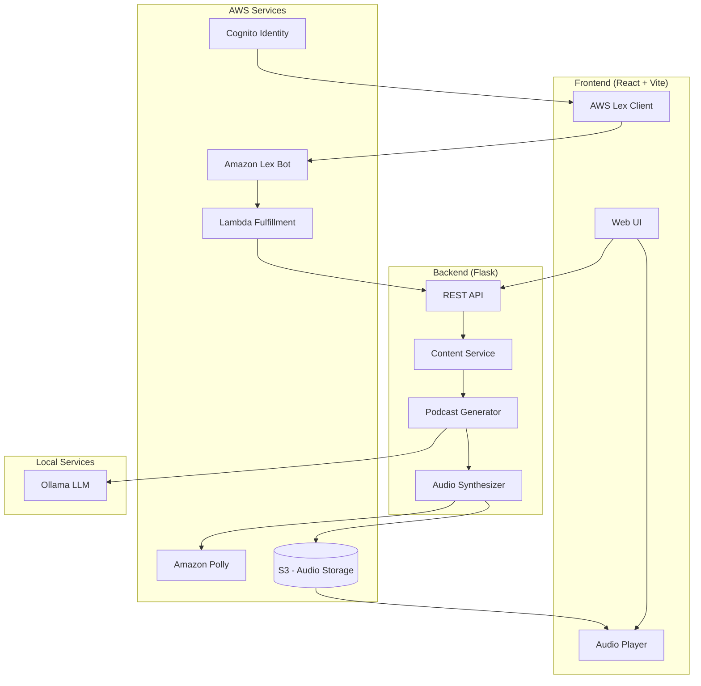

# AI Personal Tutor - Podcast-Style Learning Platform

## 🎯 Project Overview

An AI-powered personal tutor that transforms web content into engaging podcast-style audio lessons. Users provide a URL, and the system extracts content, generates educational lessons using LLMs, and synthesizes natural-sounding audio using Amazon Polly.

## 🏗️ Architecture Diagram



## ✨ Features

- 🎙️ **Podcast-Style Lessons** - Two-host conversational format for engaging learning
- 💬 **Conversational UI** - Amazon Lex-powered chat for natural interaction
- 🔗 **URL Ingestion** - Learn from any web content
- 🎧 **Neural Voices** - Amazon Polly's most realistic speech synthesis
- 📝 **Transcript Support** - Follow along with synchronized text
- ☁️ **Infrastructure as Code** - Full Terraform deployment

## 🚀 Quick Start

### Prerequisites

- AWS Account with appropriate permissions
- AWS CLI configured
- Terraform >= 1.5.0
- Node.js >= 18
- Python >= 3.11

### 1. Deploy Infrastructure

```bash
cd terraform
terraform init
terraform apply
```

### 2. Start Backend (Local Dev)

```bash
cd backend
python -m venv venv
source venv/bin/activate
pip install -r requirements.txt

# Set environment variables from Terraform outputs
export AWS_REGION=us-west-2
export S3_BUCKET=$(terraform -chdir=../terraform output -raw s3_bucket_name)
export OLLAMA_HOST=http://localhost:11434
export OLLAMA_MODEL=llama3.2

python src/app.py
```

### 3. Start Frontend (Local Dev)

```bash
cd frontend
npm install
npm run dev
```

## 📚 Documentation

- [Architecture Overview](docs/ARCHITECTURE.md)
- [Deployment Guide](docs/DEPLOYMENT.md)
- [API Reference](docs/API.md)

---

## Deploy & Demo

### Prerequisites

- AWS Account with CLI configured (`aws configure`)
- Terraform >= 1.0.0
- Node.js >= 18
- Python >= 3.11
- Ollama installed locally (for LLM inference)

### Local Development Setup

**Step 1: Install Ollama**

```bash
# Install Ollama
curl -fsSL https://ollama.com/install.sh | sh

# Pull the model
ollama pull llama3.2

# Start Ollama server (runs on port 11434)
ollama serve
```

**Step 2: Backend Setup**

```bash
cd backend

# Create and activate virtual environment
python3.11 -m venv .venv
source .venv/bin/activate

# Install dependencies
pip install -r requirements.txt

# Create environment file
cp .env.example .env
# Edit .env with your AWS credentials and S3 bucket

# Run the backend
PYTHONPATH=src python -m flask --app src/app.py run --port 8000
```

**Step 3: Frontend Setup**

```bash
cd frontend

# Install dependencies
npm install

# Create environment file (optional for local dev)
cp .env.example .env

# Run development server (uses Vite proxy for API)
npm run dev
```

### Verification Commands

```bash
# Health check (backend)
curl http://localhost:8000/health

# Health check (API v2)
curl http://localhost:8000/api/v2/health

# Create a test session
curl -X POST http://localhost:8000/api/v2/sessions \
  -H "Content-Type: application/json" \
  -d '{"url": "https://en.wikipedia.org/wiki/Python_(programming_language)", "num_lessons": 2}'

# List sessions
curl http://localhost:8000/api/v2/sessions

# Frontend (open browser)
open http://localhost:3000
```

### Terraform Deployment (AWS)

```bash
cd terraform

# Initialize Terraform
terraform init

# Review the plan
terraform plan -var="aws_region=us-east-1"

# Apply infrastructure
terraform apply -var="aws_region=us-east-1"

# Get outputs for configuration
terraform output

# Create Lex Bot Alias (required - not yet supported by Terraform)
# Copy the command from: terraform output post_deployment_commands
```

### Demo Script

1. **Start Services:**

   ```bash
   # Terminal 1: Ollama
   ollama serve

   # Terminal 2: Backend
   cd backend && source .venv/bin/activate && PYTHONPATH=src python -m flask --app src/app.py run --port 8000

   # Terminal 3: Frontend
   cd frontend && npm run dev
   ```

2. **Open App:** Navigate to http://localhost:3000

3. **Chat with Tutor:**

   - Type "hello" to see welcome message
   - Paste a URL like `https://docs.python.org/3/tutorial/introduction.html`
   - Wait for lesson generation
   - Click "Start Lesson 1" to play audio

4. **API Demo (curl):**

   ```bash
   # Create session
   SESSION=$(curl -s -X POST http://localhost:8000/api/v2/sessions \
     -H "Content-Type: application/json" \
     -d '{"url": "https://example.com"}' | jq -r '.session_id')

   echo "Session ID: $SESSION"

   # Check session status
   curl http://localhost:8000/api/v2/sessions/$SESSION

   # Generate lesson 1
   curl -X POST http://localhost:8000/api/v2/sessions/$SESSION/lessons/1/generate
   ```

### Running Tests

```bash
cd backend
source .venv/bin/activate

# Run all tests (136 tests)
PYTHONPATH=src pytest tests/ -v

# Run with coverage
PYTHONPATH=src pytest tests/ --cov=src --cov-report=html

# Run specific test file
PYTHONPATH=src pytest tests/test_integration.py -v
```

### Troubleshooting

| Issue                        | Solution                                          |
| ---------------------------- | ------------------------------------------------- |
| `Ollama connection refused`  | Start Ollama with `ollama serve`                  |
| `No module named 'services'` | Set `PYTHONPATH=src` before running               |
| `S3 bucket 403`              | Check AWS credentials and bucket permissions      |
| `Polly validation error`     | Update boto3: `pip install --upgrade boto3`       |
| `Frontend API errors`        | Ensure backend is running on port 8000            |
| `Lex not working`            | Create bot alias manually (see Terraform outputs) |

---

## License

Educational use only - Code Platoon AI Cohort

---

_Built with ❤️ for the AICO Delta cohort_
